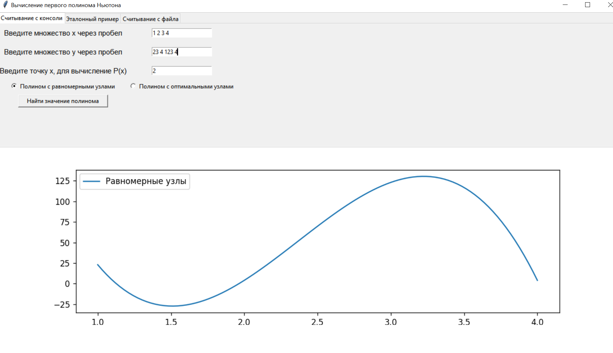
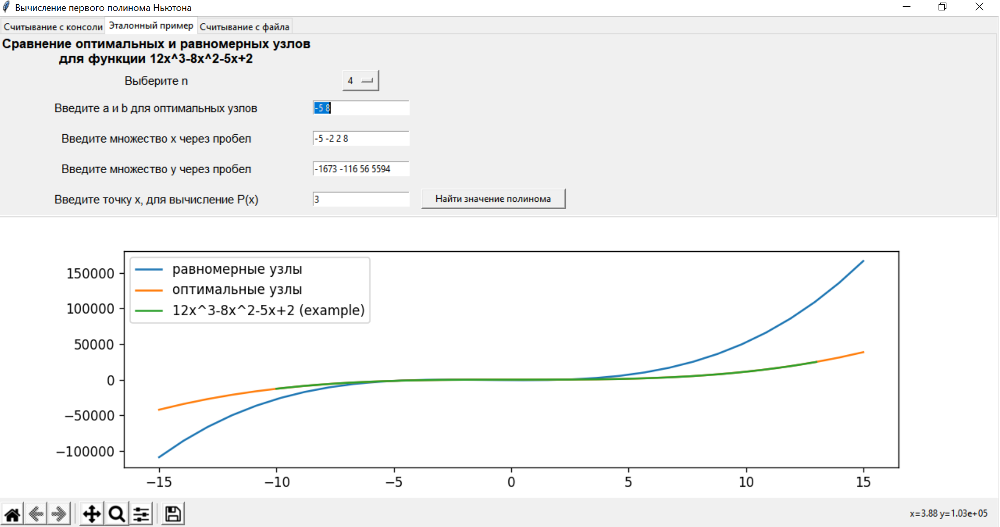
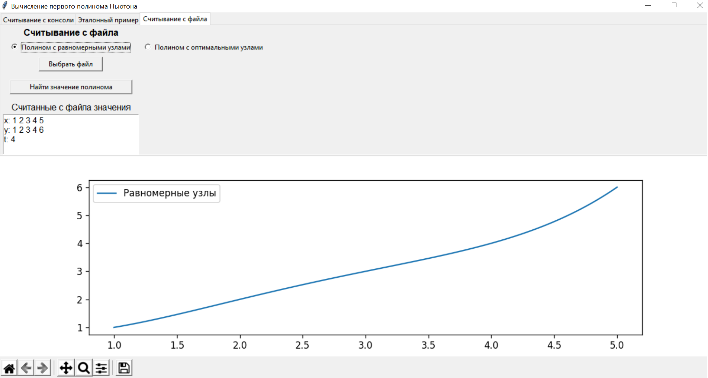
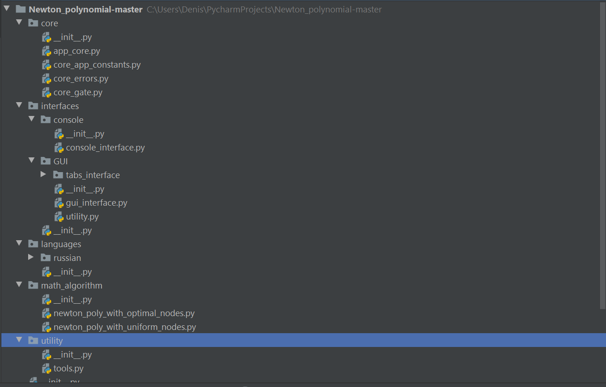
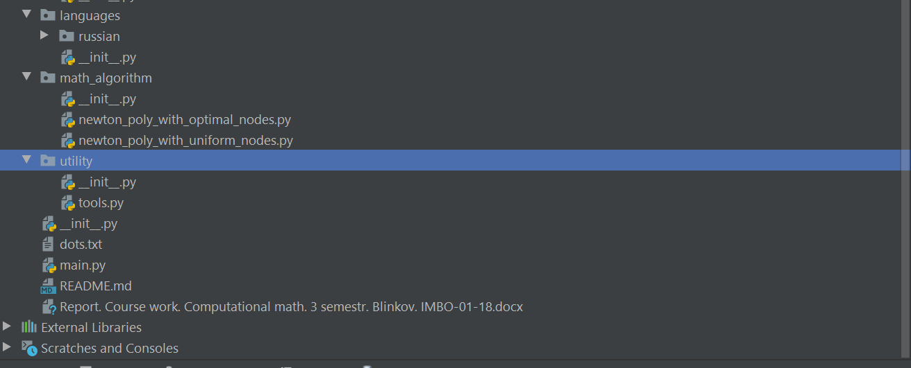
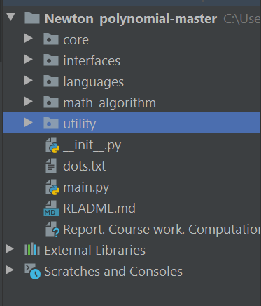

<<<<<<< HEAD
# Application for polynomial approximation using nodes

To be honest, I'm writing this readme after 15 months when the project was written;
The project is a part of a course work from the university I study in 

This is the ui-based application that uses computational mathematics' methods for polynomial 
approximation

The main goal of the app is next: you have set of (x, y) nodes, but you don't know
The function and the application is trying to approximate function and to calculate approximated function 
at specified x  

When the app is started, you see three tabs

First tab is for manually input data: you manually input set of (x, y) nodes
and next the x you wanna to;

There are two options for nodes - optimal (Chebyshev's ) and uniform distribution for nodes  
Choose any and input data, click the button and you'll see the result on the graph
The app will paint the approximated function 

Second tab demonstrates comparing between optimal and uniform nodes using already specified function

The third tab demonstrates a possibility to input data via a file

P.S. I wanted to refactor this project, but It was a bit hard so I decided not to do it bkz it's not so important or 
just laziness

This project should have had the next structure, but refactoring didn't happen

=======
# Newton_polynomial

This harmful project should have had next structure, but refactoring this code wasn't possible

>>>>>>> 5a55ef66b279a68dd2145a078146501617883da9
